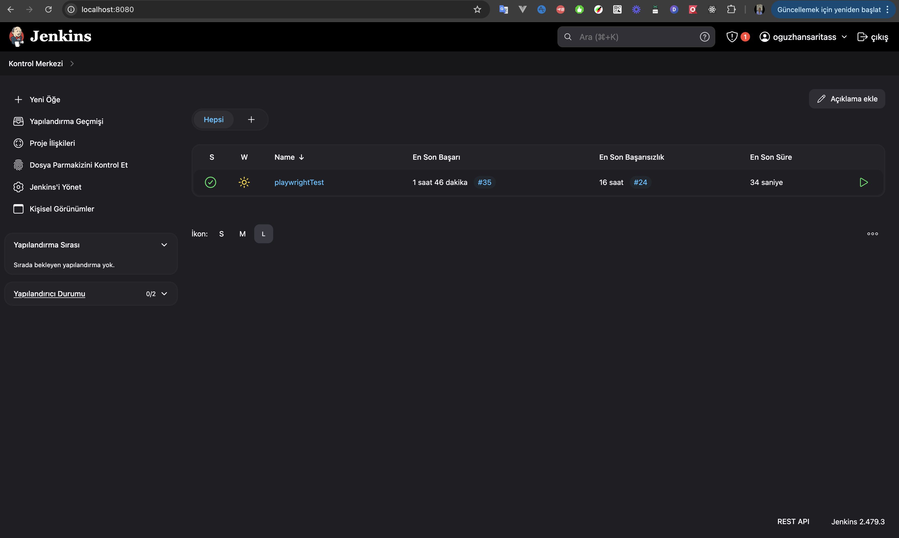
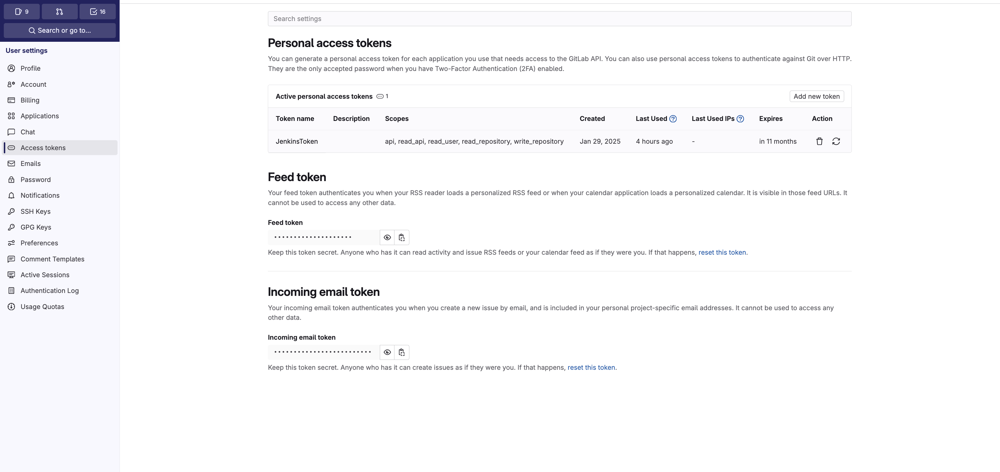
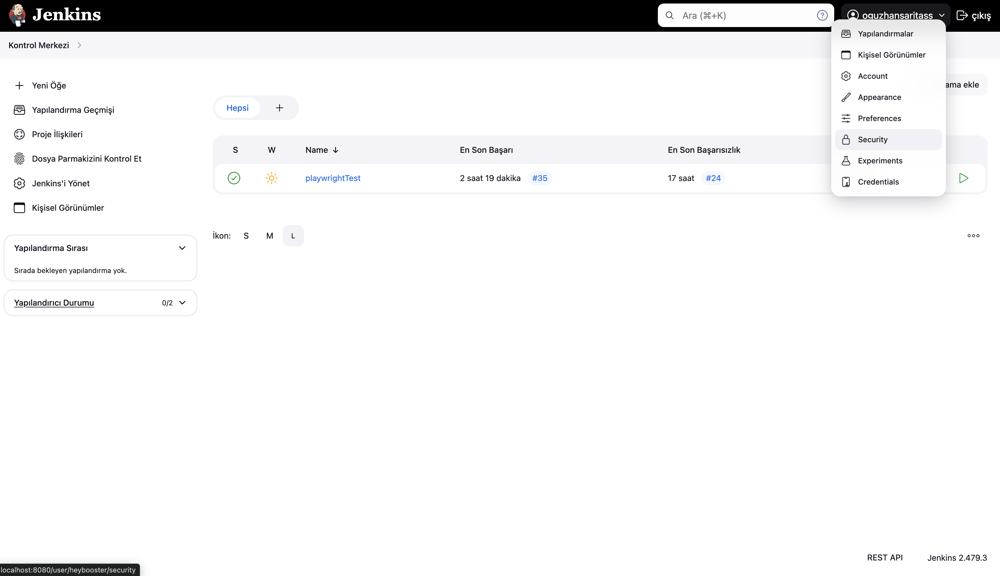

This document provides a step-by-step guide on setting up and running the project inside Docker, obtaining the Jenkins token, retrieving the GitLab token, configuring Jenkins credentials, creating a Jenkins pipeline, and setting up security configurations. By following these steps, Docker will launch the project, and Jenkins will execute the tests on the panel.

## Step 1: Install Docker
* Open a terminal and navigate to the project directory. Then, run the following command to install Docker:

```bash
brew install --cask docker
```
----
## Step 2: Launch Docker
* Open a terminal and navigate to the project directory. Then, run the following command to launch Docker:

```bash
brew services start docker

```
## NOTE
* If docker is installed on your computer, we will stand up with this command.

```bash
docker-compose up --build -d
```
----
## Step 3: Jenkins installation
* Localhost: Go to 8080 after removing the project. Jenkins will ask you for an Initial Admin Password.


* To get the Security Tokeni (Initial Admin Password) Enter this code in the project directory

```bash
 //First go to Jenkins Docker 
 
docker exec -it jenkins sh 

// Then, enter the following command to obtain the Jenkins token. 
Insert the provided token into the designated token field shown in the image and click Continue.

cat /var/jenkins_home/secrets/initialAdminPassword

```
----

## Step 4: Customize Jenkins

* Download the plugins required and after completion of the plugins installation click on continue.
* use the install suggested plugins option


----
## Step 5: Create First Admin User 


* After that an admin user page will open where you can set the your coustmize the user name and password according to the orgnization requirments.

* Here as username : heybooster
  * password : 1234
  * fullname : oguzhannsaritas
  * email : email adress

*click on save and continue after that you can aceses the the jenkins UI.

----

## Step 6: jenkins UI. ( CREATE JOB )

* In this section click create job and create your job


----

## Step 7: CREATE JOB NAME. ( START BUILD JENKINS JOB )

* Give job name in this section Suggested name : `playwrightTest`
* Select the Pipline option


----

## Step 8: jenkins UI. ( START BUILD JENKINS JOB )
* Great now we have completed the job installation.

  

* In this section, click on the Manage jenkis button
  
* Click on the security button here
* On the security page, tick the (Allow anonymous read access) and (Enable API Token usage statistics) options. If they are ticked, leave them as they are, but if they are not ticked, tick them.

* Then go back and click on the credentials button. So go to the credentials page.  

  

* Click on the (global) option seen here and from there go to ( add Credentials)

  

* On this page we will create our credentials and from here we will be able to run our files in the gitlab repo.
* To fill in the blanks in these sections, you must first get tokens from your gitlab account.

  

* We can get our token by pressing the add new token button.

  
* Click on the options in the picture, give your token name and make the date unspecific, then create your token. 

# Note !!

* Gitlab will give the token only once, please keep this token somewhere because we will use this token in several places.

  


* User Name : `your gitlab username ( Example : oguzhannsaritas )`
* ID : `gitlab-credentials`
* Password : `( Your newly created GitLab token )`

* Create it.

---


## Step 9: JENKINS TOKEN.

* In this section, click on your user at the top right and go to security

----


* From here, give your token a name and press the Generate button. 

## Note !!

* Jenkins will give you an API token to use here, please keep it because we will use it
* Press the Apply button and save.
* Replace the Jenkins API Token you created with the value in the JENKIS_TOKEN value in the .env file in your project.


----

## Step 10: EDIT CONFIGURATION.

* Go back to your home screen.
* Hover over the job you created and click the edit configration button


----


* Here, select Definition with Pipline Script as shown in the picture.
* Paste the script from the jenkinsFile file in the project into the script here and save it.

---

## Step 11: Update.

* Now you are ready to run the tests and finally we need to update the changes in docker;
* Enter this code in the project directory;


```bash
docker-compose down  
```


* Then enter this code to update it;


```bash
docker-compose up --build -d 
```

* Docker will stand up again and you will be able to use the .env file with its files in an updated way.

* To go to TestPanel and jenkins;


* `TestPanel : Localhost:3006`
* `jenkinsPanel : Localhost:8080`

* To enter Jenkinse, you will enter the account you created at first. 
* `YOUR NAME`
* `YOUR PASSWORD`

* TestPanel ;
  * `YOUR MAİL @hotmail.com`
  * `YOUR PASSWORD`

